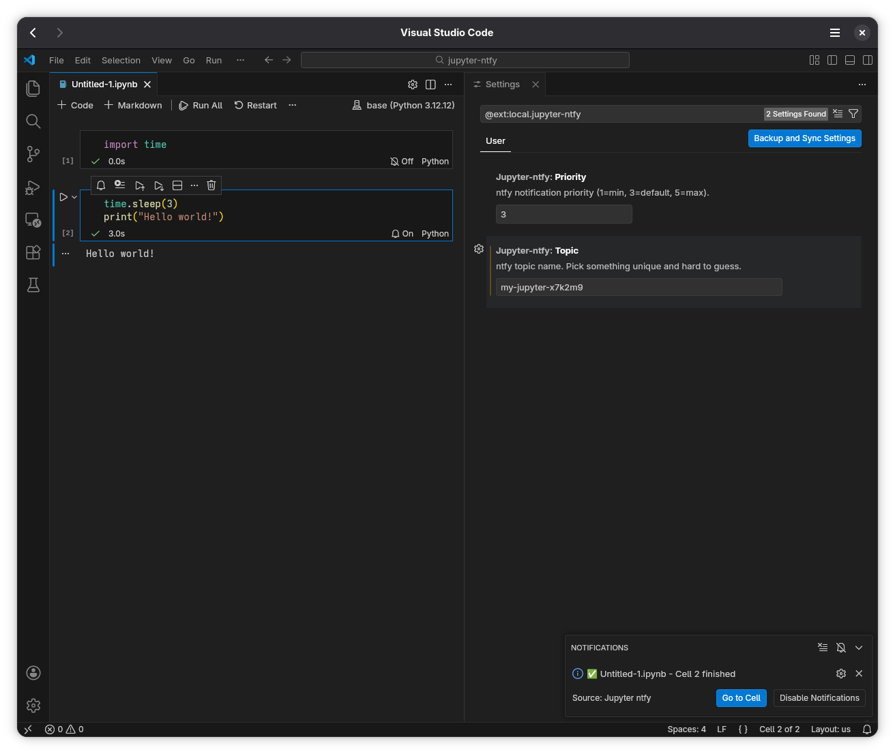

# Jupyter ntfy

Get [ntfy](https://ntfy.sh) push notifications when Jupyter notebook cells finish running. Useful for long-running cells — get notified on your phone, desktop, or any device.

---

## Preview

---

## Features

- Bell icon in each cell's toolbar to toggle notifications
- Push notifications when cells complete or fail
- Markdown-formatted messages with cell input and output
- Clean error formatting — tracebacks are stripped of terminal codes
- In-editor popup with "Go to Cell" and "Disable Notifications" actions
- Persistent toggles saved to notebook metadata
- Works with ntfy.sh or any self-hosted ntfy instance
- Username/password authentication for access-controlled topics

---

## Requirements

- VS Code 1.74+
- [Jupyter](https://marketplace.visualstudio.com/items?itemName=ms-toolsai.jupyter) extension for VS Code

---

## Installation

### From the Marketplace

1. Open **Extensions** (`Ctrl+Shift+X`)
2. Search for **"Jupyter ntfy"**
3. Click **Install**

---

## Setup

1. Install the [ntfy app](https://ntfy.sh) on your phone or subscribe to a topic at [ntfy.sh](https://ntfy.sh)
2. In VS Code, open **Settings** and search for `jupyter-ntfy`
3. Set your server and topic
4. If your topic requires authentication, set your username in settings and run **"Jupyter ntfy: Set ntfy Password"** from the command palette (`Ctrl+Shift+P`)
5. Open a Jupyter notebook, click the bell icon on a cell, and run it

---

## Settings

| Setting | Description | Default |
|---|---|---|
| `jupyter-ntfy.server` | Hostname of the ntfy server | `ntfy.sh` |
| `jupyter-ntfy.topic` | Topic to publish to | `""` |
| `jupyter-ntfy.username` | Username for access-controlled topics | `""` |

To set your password, run **"Jupyter ntfy: Set ntfy Password"** from the command palette. The password is stored securely in the system keychain and never written to disk.

---

## How it works

When a cell with notifications enabled finishes executing, the extension:

1. Shows a VS Code popup with the result
2. Sends a POST request to `https://<server>/<topic>` with:
   - **Title**: `filename.ipynb - Cell N finished` (or `failed`)
   - **Body**: Markdown-formatted cell input and output
   - **Tags**: checkmark or X emoji based on success/failure
   - **Authorization**: Basic auth header if username and password are set

---

## Privacy

- **No backend server** — notifications are sent directly from VS Code to your ntfy server
- **No telemetry** — the extension does not collect or transmit any data beyond the ntfy notification itself
- **Passwords stored securely** — credentials are kept in the OS keychain via VS Code's SecretStorage API

---

## License

MIT — forked from [Jupyter Cell Notifier](https://github.com/ckm3/jupyter-cell-notifier) by Kaiming Cui.

Built with the assistance of [Claude](https://claude.ai).
